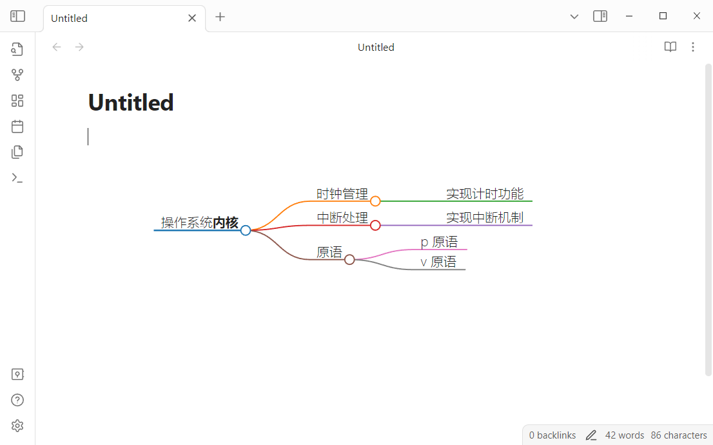

# Obsidian Mindmap Block

在文本中将具有层级结构的内容转换为思维导图，例如无序列表、有序列表、多级标题等。渲染的思维导图可鼠标拖拽，可滚轮缩放，点击结点可以将结点折叠。

## How to use

````
```mindmap

# 操作系统内核

- 时钟管理
    - 实现计时功能
- 中断处理
    - 实现中断机制
- 原语
    - p 原语
    - v 原语
```
````

````
```mindmap
# 操作系统**内核**

## 时钟管理

实现计时功能

## 中断处理

实现中断机制

## 原语

- p 原语
- v 原语
```
````




## Thanks

- [obsidian-mind-map](https://github.com/lynchjames/obsidian-mind-map)
- [markmap](https://github.com/markmap/markmap)